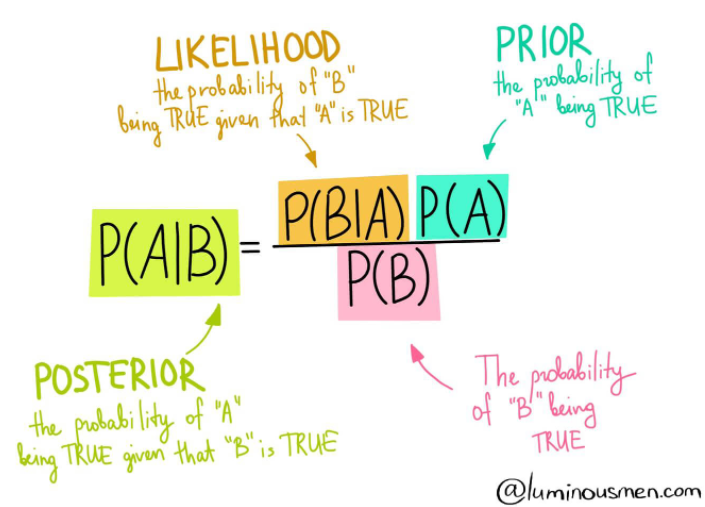

### Naive Bayes Classifier

Naive Bayes operates as a classification technique grounded in Bayes Theorem, employing a probabilistic approach wherein it assumes prior probabilities of conditions possibly associated with the event. Bayes Theorem presupposes independence among predictors. Essentially, it intuitively posits that the input features utilized by the model are unrelated to each other, implying that altering one input feature will not influence any others, despite datasets often deviating from this assumption.

**Applications:**
- Real-time Prediction
- Multi-class Prediction
- Text classification/ Spam Filtering/ Sentiment Analysis
- Recommendation Systems

Bayes Rule is represented by the following algorithm (also at the top of this page):
P(A|B) = (P(B|A) * P(A)) / P(B). This tells us how often A happens *given that* B happens, when we know how often B happens *given that* A happens, how likely A is on its own, and how likely B is on its own.

There are three main types of classifiers:
- **Gaussian Naive Bayes**: used when the values of predictors are continuous in nature and it is assumed that they follow Gaussian (normal) distribution
- **Bermoulli Naive Bayes**: used when the predictors are boolean/binary in nautre and it is assumed they follow Bernoulli distribution
- **Multinomial Naive Bayes**: uses multinomimal distribution and is used when features represent frequency of something occurring, like the number of words in a document or text classification purposes

For more details refer to the [this article](https://medium.datadriveninvestor.com/what-are-naive-bayes-classifiers-dd8bc49db817).

---

This sub-repository mainly focuses on using Naive Bayes Classifier Algorithm to solve classification problems.

Contents of **Naive Bayes**

* [Image](https://github.com/sharma7056/renuinde577project/tree/main/SupervisedLearning/7%20-%20naive%20bayes%20classifier/Image): contains images used in README
* [Data](https://github.com/sharma7056/renuinde577project/tree/main/SupervisedLearning/7%20-%20naive%20bayes%20classifier/Data): contains all data files used in this module
  * [Hawk.csv](https://github.com/sharma7056/renuinde577project/blob/main/SupervisedLearning/7%20-%20naive%20bayes%20classifier/Data/Hawks.csv): Hawk Dataset
* [Naive Bayes Classifier.ipynb](https://github.com/sharma7056/renuinde577project/blob/main/SupervisedLearning/7%20-%20naive%20bayes%20classifier/Naive%20Bayes%20Classifier.ipynb): Jupyter notebook file contains the implementation of Naive Bayes Classifier