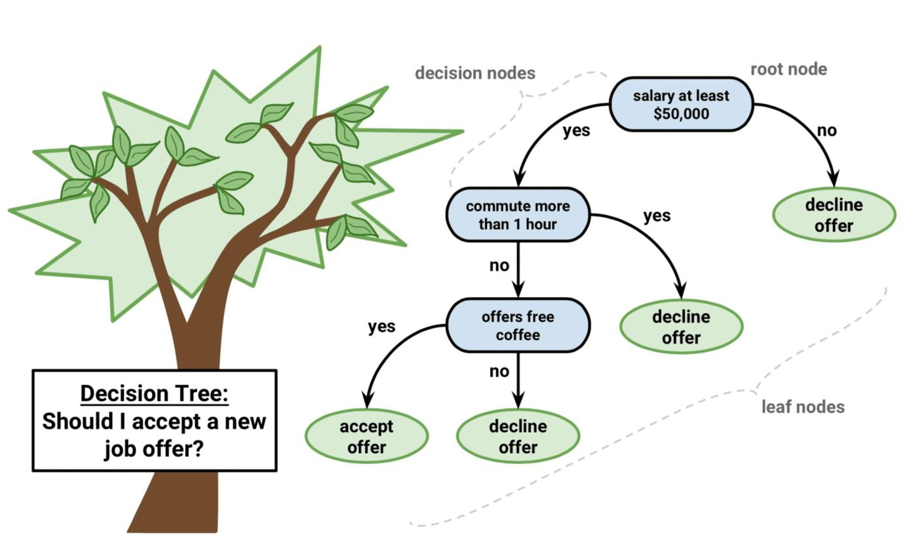

# Decision Tree

Decision trees are applicable to both classification and regression problems, leveraging the analogy of a tree. In this structure, each internal node represents a data attribute, while each leaf node corresponds to a class label. As a non-parametric supervised machine learning algorithm, decision trees continuously partition data based on specific parameters. Beginning with the root node, the tree progressively divides into two or more homogeneous subsets at decision nodes. Ultimately, the leaves denote the final outcomes or decisions.

# Algorithm:
1. Put the best attribute of the dataset at the _root_ of the tree.
   - Compare the values of the root attribute with the record's attribute, then follow the branch corresponding to that value and jump to the next node using the **Sum of Product representation (or Disjunctive Normal Form)**. For a class, every branch from the root of the tree to a leaf node having the same class is a conjunction (product) of values, different branches ending in that class form disjunction (sum).
2. Split training set into _subsets_ in such a way that each subset contains data with the same value for an attribute.
3. Repeat 1-2 on each subset until you find _leaf nodes_ in all the branches of the tree.
   - Compare the attribute values of the record with those of other internal nodes in the tree until we arrive at a leaf node containing the predicted class value.
   - The main difficulty lies in deciding which attributes to assess at each stage. Several widely-used measures for attribute selection include:
   
     - Entropy (Information gain) is a metric to measures the impurity, or uncertainty in data. 
       - Assume attributes are categorical and try to estimate the information contained by each attribute
       - Entropy measures randomness or uncertainty of a random variable X. In a binary classification problem, if all examples are positive or all are negative, entropy will be 0 (i.e. low). If half the records are of positive class and half are of negative class, entropy is 1 (i.e. high).
       - The formula of entropy is:
       Entropy = Σ (from i=1 to c) of (-P_i * log₂(P_i))

       where `c` is the total number of classes and `P_i` is the probability of class `i` in the node.

    
    - Gini index: Gini index is used to determine the impurity or purity when building a decision tree in the classification and regression tree (CART) algorithm.
      - Assume attributes are continuous, the index is a metric that measures how often a randomly chosen element would be incorrectly identified. Thus, we prefer a low gini index. The formula of Gini index is: The formula for the Gini index is:
      
      Gini = 1 - Σ (from i=1 to c) of (P_i^2)

     where `c` is the total number of classes and `P_i` is the probability of class `i` in the node.
  

   - Information Gain (IG): Information gain serves as the criterion for determining which feature to split at each stage during decision tree construction. The decision tree algorithm aims to maximize information gain, selecting the split with the highest value accordingly. The formula for Information Gain is:

   Information Gain = Entropy(Parent) - [Weighted Sum of Entropy(Children)]

   where `Entropy(Parent)` is the entropy of the starting node, and `Weighted Sum of Entropy(Children)` is the sum of the entropies of each split node, weighted by the proportion of members in each child node compared to the parent.

   - Confusion Matrix: A confusion matrix is a tabular representation utilized to assess the effectiveness of a classification algorithm. It contrasts the actual values with those predicted by the model.

There are four basic terms:

* True Positive: An outcome where the model correctly predicts the positive class.
* True Negative: An outcome where the model correctly predicts the negative class.
* False Positive: An outcome where the model incorrectly predicts the positive class.
* False Negative: An outcome where the model incorrectly predicts the negative class.

Based on these four terms, we can also calculate the Accuracy. These parameters can be used to evaluate the algorithm.

There are a few assumptions with the training set: 
- At the beginning, the root is the whole training set
- Categorical feature values are preferred, and if the values are continuous, they are discretized before constructing the model.
- Records are distributed recursively on the basis of attribute values
- Order to placing attributes as root or internal node of the tree is done using some statistical approach

Overfitting is a common issue with decision trees. There are two approaches to avoid this:
- Pre-Pruning
  - Stops the construction of the tree prematurely. It's preferable to avoid splitting a node if its goodness measure falls below a threshold, although determining the appropriate stopping point can be challenging.
- Post-pruning
  - Build a complete tree. If the tree demonstrates overfitting, then prune using cross-validation data to check the effect. The cross validation data tests whether expanding a node will make an improvement (increase in accuracy) or not

---

This sub-repository mainly focuses on using Decision Tree Algorithm to solve classification problems.

Contents of **Decision Tree**

  * [Data](https://github.com/sharma7056/renuinde577project/tree/main/SupervisedLearning/8%20-%20Decision%20Tree/Data): Penguins Dataset
* [Decision Tree](https://github.com/sharma7056/renuinde577project/blob/main/SupervisedLearning/8%20-%20Decision%20Tree/Decision%20Tree.ipynb): Jupyter notebook file containing
  * a. Introduction of the decision tree algorithm
  * b. Performing the decision tree algorithm using penguins dataset to classify penguins species
  * c. Using confusion matrix to evaluate the algorithm
  * d. Increasing the depth of the decision tree algorithm and compare

### Datasets
* Penguins Dataset:

The Penguins Dataset contains size measurements for three penguin species observed on three islands in the Palmer Archipelago, Antarctica. These data were collected from 2007 - 2009 by Dr. Kristen Gorman's team. It consists of 344 rows and 7 columns. The three different species of penguins are Chinstrap, Adélie, and Gentoo penguins.
